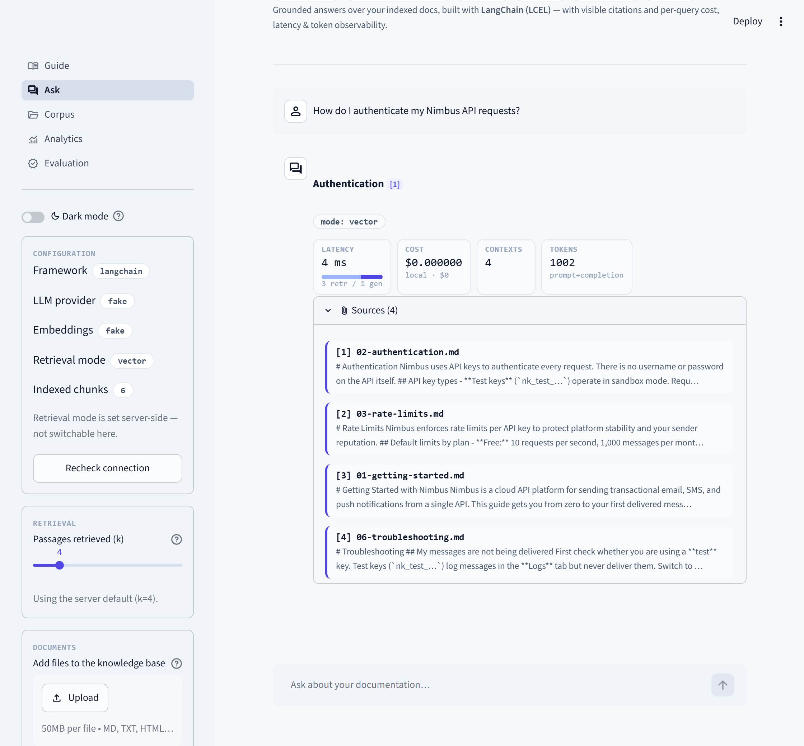
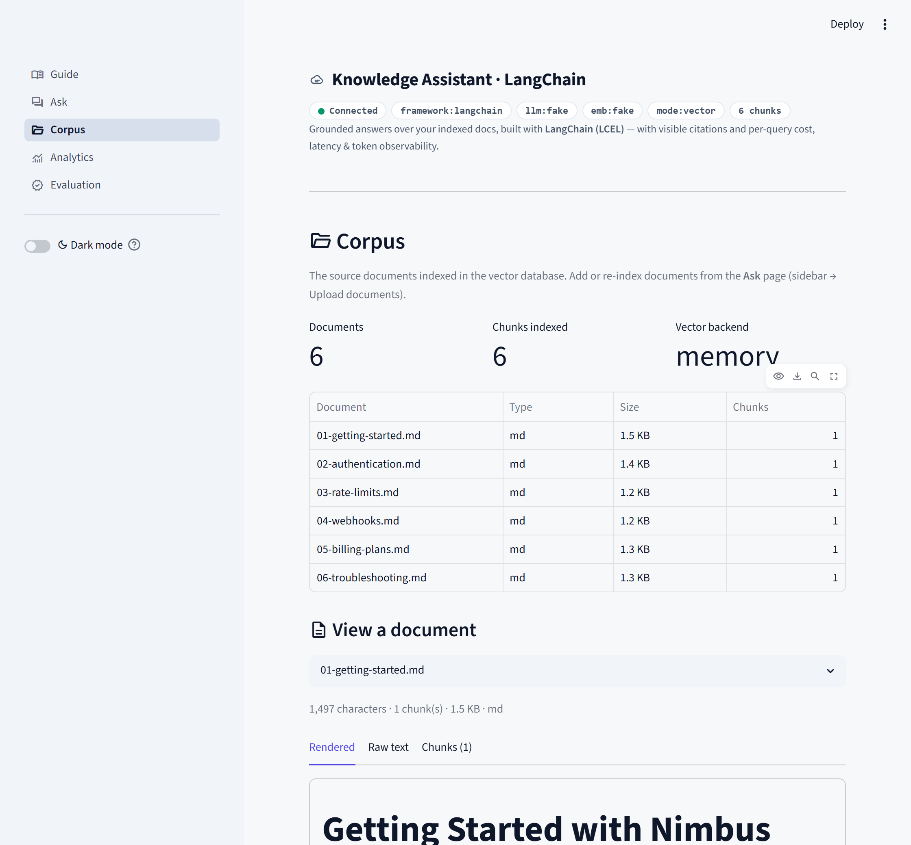
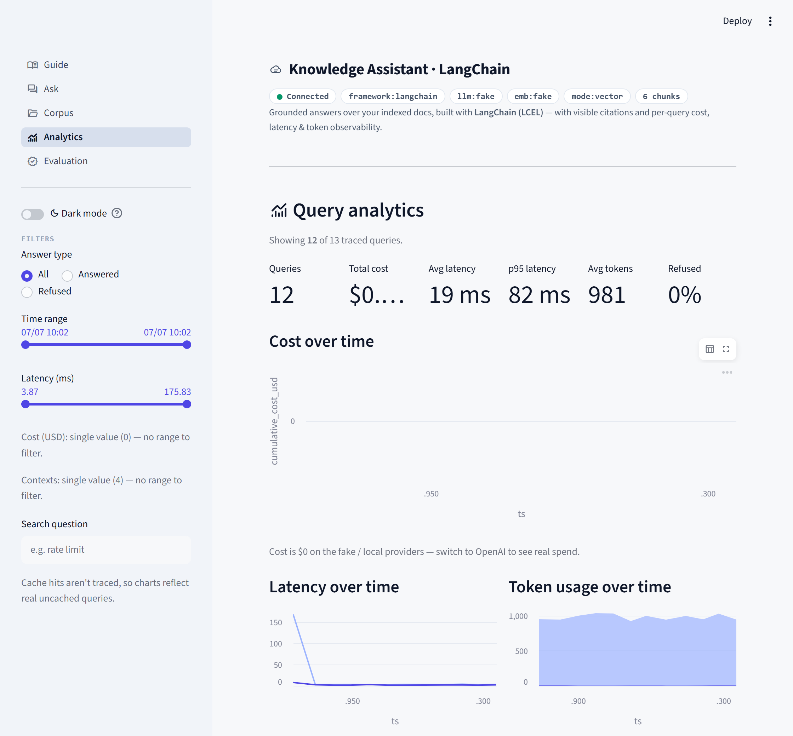
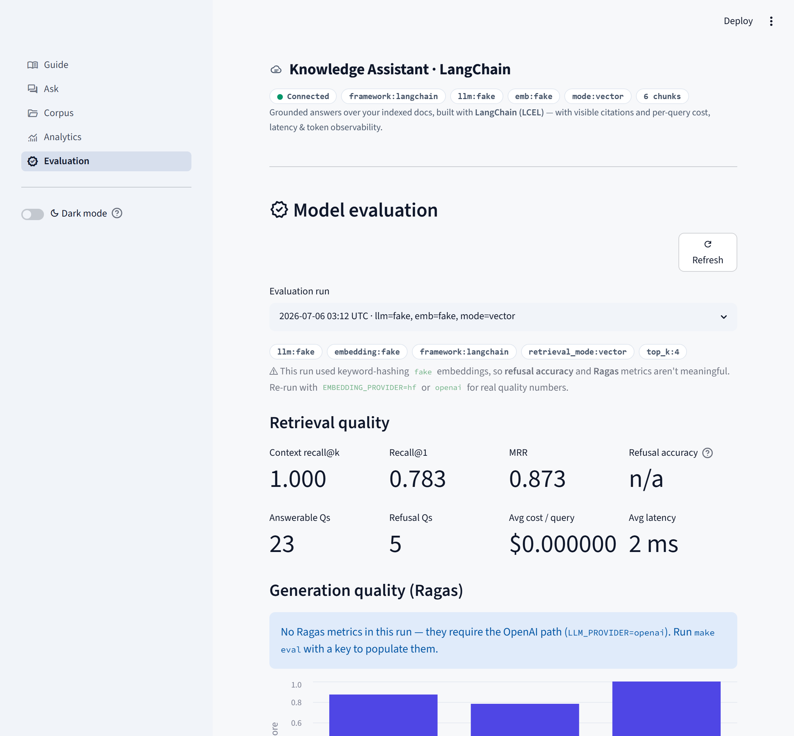
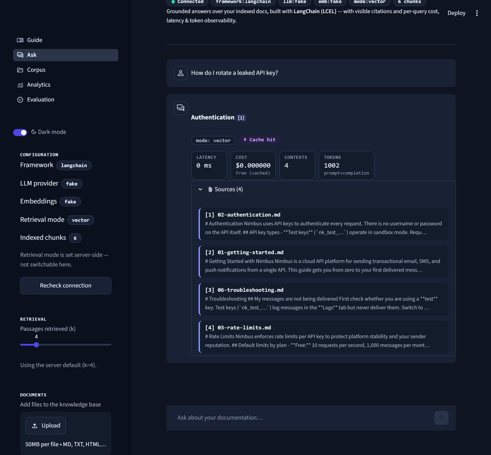

# RAG Knowledge Assistant — LangChain variant

> A standalone re-implementation of my from-scratch RAG service, built
> **idiomatically with LangChain** (LCEL chains, LangChain retrievers, vector
> stores, and chat models). Same product and behaviour — grounded, cited answers
> with a refusal path, a keyless mode, and vector **or** hybrid retrieval — but
> expressed with the industry-standard framework.


-1C3C3C)


> This is a **companion** to my framework-free RAG project (a sibling repo built
> from scratch with no framework). Building the same system both ways — with the
> **same product, UI/UX and feature set** — shows two things employers value: I
> can implement RAG from first principles **and** ship it idiomatically with
> LangChain.

---

## Screenshots

*The Streamlit console is a thin client over the LangChain FastAPI service. Shown
here in keyless `fake` mode; the exact same UI runs on OpenAI or local Hugging Face.*

**Ask** — grounded answers with inline `[n]` citations, a per-query telemetry
strip (latency split · cost · contexts · tokens), and the retrieved source passages:

[](assets/screenshots/ask.png)

| **Corpus** — browse exactly what the vector store indexed | **Analytics** — per-query cost / latency / token dashboard |
|:--:|:--:|
| [](assets/screenshots/corpus.png) | [](assets/screenshots/analytics.png) |
| **Evaluation** — retrieval metrics + Ragas (keyless run shown; Ragas on the OpenAI path) | **Dark mode** — full light / dark theming |
| [](assets/screenshots/evaluation.png) | [](assets/screenshots/ask-dark.png) |

---

## What this demonstrates (LangChain idioms)

| Concern | LangChain building block used here |
|---|---|
| Prompt | `ChatPromptTemplate` (system + human) with the grounding/citation/refusal rules |
| Generation | an **LCEL** chain: `prompt | chat_model | StrOutputParser()` |
| Chat model | `ChatOpenAI` / `ChatHuggingFace`, or a keyless `SimpleChatModel` (`FakeGroundedChatModel`) |
| Embeddings | `OpenAIEmbeddings` / `HuggingFaceEmbeddings`, or a keyless `Embeddings` subclass (`KeywordHashEmbeddings`) |
| Vector store | `InMemoryVectorStore` (zero external services) |
| Retriever | `vectorstore.as_retriever()`, or hybrid `EnsembleRetriever([BM25Retriever, vector])` |
| Chunking | `RecursiveCharacterTextSplitter` |

Everything stays swappable by config, and the **keyless `fake` providers are real
LangChain classes** (a custom `Embeddings` and a `SimpleChatModel`), so tests and
CI run with **no API key**.

## Quickstart — no API key

```bash
pip install -r requirements.txt
cp .env.example .env          # defaults to the keyless 'fake' providers
uvicorn src.rag_lc.api:app --reload --port 8000   # API → http://localhost:8000  (docs at /docs)
streamlit run ui/streamlit_app.py                 # UI → http://localhost:8501  (second terminal)
pytest -q                                         # keyless tests
python -m eval.run_eval --no-ragas                # recall@k / recall@1 / MRR (writes a report)
python -m eval.run_eval --compare                 # vector vs hybrid A/B
```

> **On Windows, or no `make`?** Run the commands above directly — the `Makefile`
> is just optional shorthand. Map: `make api` → `uvicorn src.rag_lc.api:app --reload --port 8000`,
> `make ui` → `streamlit run ui/streamlit_app.py`, `make test` → `pytest -q`,
> `make eval` → `python -m eval.run_eval` (`--no-ragas` to skip Ragas),
> `make eval-compare` → `python -m eval.run_eval --compare`.

Ask a question:

```bash
curl -s localhost:8000/query -H 'content-type: application/json' \
  -d '{"question":"What webhook events does Nimbus emit?"}' | python -m json.tool
```

## UI — a multipage Streamlit console

`streamlit run ui/streamlit_app.py` starts a polished, **multipage** Streamlit client over the API (a thin
client — every action is an HTTP call). Five pages share one session:

- **Ask** — chat-first grounded Q&A: tinted `[n]` citations, a per-answer
  telemetry strip (retrieval-vs-generation latency, cost, tokens, contexts), an
  `⚡ Cache hit` badge, `k` control, document upload (`.md/.txt/.html/.pdf`) and
  re-index.
- **Corpus** — browse the indexed source documents: each file's type, size and
  chunk count, plus a viewer showing the extracted text and the chunks the vector
  store actually holds.
- **Analytics** — a filterable dashboard over the query traces: cost/latency/token
  time-series, a latency histogram, a most-retrieved-documents chart, a scatter,
  and an exportable query log.
- **Evaluation** — a read-only dashboard over the eval reports: retrieval metrics,
  Ragas generation metrics (on the OpenAI path), a vector-vs-hybrid A/B chart, a
  metric trend across runs, and a per-question pass/fail table.
- **Guide** — an in-app tutorial explaining how to use the app and what every
  metric and evaluation number means.

A **light/dark theme toggle** (in the sidebar, under the page nav) switches the
whole console between themes. This mirrors the from-scratch repo's UI/UX exactly,
adapted to the LangChain API contract.

## Run with real models

```bash
# OpenAI
pip install langchain-openai
# .env: LLM_PROVIDER=openai, EMBEDDING_PROVIDER=openai, OPENAI_API_KEY=sk-...

# Free local Hugging Face (no API key)
pip install langchain-huggingface transformers sentence-transformers torch
# .env: LLM_PROVIDER=hf, EMBEDDING_PROVIDER=hf
```

## Hybrid retrieval

Set `RETRIEVAL_MODE=hybrid` to fuse **BM25** (keyword) with the **vector**
retriever via LangChain's `EnsembleRetriever` (reciprocal-rank-fusion style
weighting) — better ranking for exact tokens like error codes and API names.

## Deploy — Docker & free-tier cloud

The full stack — Postgres + `pgvector` (`langchain-postgres`), the API, and the
Streamlit UI — comes up with one command, on your laptop or a single cloud VM:

```bash
docker compose up -d --build     # db + api + ui   (UI :8501 · API :8000)
docker compose run --rm eval     # optional: populate the Evaluation page (retrieval + Ragas)
```

For a real deployment put `LLM_PROVIDER=openai`, `EMBEDDING_PROVIDER=openai`,
`VECTOR_BACKEND=pgvector` and `OPENAI_API_KEY` in `.env`; set `APP_PASSWORD` (UI
login) and `API_KEY` (gates `/query`, `/ingest`, `/upload`) to protect a public
host. The API image ingests the corpus into pgvector on start, then serves.

It fits a **free-tier VM** — Google Cloud Always-Free `e2-micro`, or Oracle Cloud
Always-Free Ampere **A1** (2 vCPU / 12 GB). The whole stack is `arm64`-clean, so it
runs natively on Oracle's ARM instances.

## Project structure

```
src/rag_lc/
  config.py       typed settings (pydantic-settings); defaults = keyless fake
  prompts.py      ChatPromptTemplate (grounding / citation / refusal)
  components.py   factories: Embeddings, ChatModel, vector store, retriever
                  (+ keyless KeywordHashEmbeddings & FakeGroundedChatModel)
  ingest.py       RecursiveCharacterTextSplitter -> chunk Documents
  schemas.py      Citation & Answer result records returned by the pipeline / API
  pipeline.py     retrieve -> format context -> LCEL chain -> trace -> Answer (+ LRU answer cache)
  observability.py per-query traces (tokens, cost, latency) + records/aggregate
  api.py          FastAPI: /health /ingest /upload /query /metrics /analytics /eval-results /documents /documents/{name}
ui/
  streamlit_app.py  multipage router (st.navigation, thin client over the API)
  common.py         shared config, styling and API helpers
  views/chat.py     grounded chat with citations + telemetry
  views/corpus.py    browse the indexed source documents (files + chunks)
  views/analytics.py filterable charts over the query traces
  views/evaluation.py read-only dashboard of the eval reports (retrieval + Ragas + A/B)
  views/guide.py    in-app tutorial: how to use the app + what every metric means
data/docs/        the same "Nimbus" demo corpus
eval/             golden set + retrieval/Ragas/A-B harness -> eval/results (+ CI gate)
tests/            keyless end-to-end tests
```

## How it differs from the from-scratch version

- **Uses LangChain** for the retriever, vector store, chat model, splitter, prompt
  and the LCEL chain (the from-scratch repo hand-writes all of these).
- The keyless mode is implemented as **real LangChain classes** (a custom
  `Embeddings` and a `SimpleChatModel`), so it stays framework-idiomatic.
- Mirrors the from-scratch repo's **observability**: every query is traced
  (retrieval vs generation timing, tokens, USD cost) and rolled up at `/metrics`,
  exposed per-query at `/analytics`, and charted on the Analytics page. Token
  usage is captured via LangChain's usage-metadata callback (real on OpenAI,
  word-count-approximated on the keyless/local paths, which cost $0).
- **Same feature set and UI/UX** as the from-scratch repo: the multipage console
  (Ask/Corpus/Analytics/Evaluation/Guide), an **LRU answer cache** (repeat questions are
  free, marked `⚡`), an evaluation harness that writes reports for the Evaluation
  dashboard, and API hardening (a request-size guard, threadpool re-index, and a
  lock-guarded pipeline singleton).
- Storage is swappable by config: the default is an `InMemoryVectorStore` (zero
  external services), and `VECTOR_BACKEND=pgvector` uses LangChain's `PGVector`
  (Postgres + pgvector) for persistence — the backend the Docker / cloud deploy
  runs on. (The from-scratch repo offers a NumPy store or the same pgvector.)

## A note on the keyless `fake` mode

The `fake` providers are real LangChain classes but deliberately simple: the
embeddings match on **keywords** (not meaning) and the chat model **echoes the
top retrieved passage** rather than composing a fresh answer. So on the fake
path the *retrieved sources* are correct (which is what the tests and eval
assert), but the answer text is a stand-in and `refusal_accuracy` is expected to
be `0.0`. Switch to `openai` or local `hf` for genuine generation and meaningful
refusal / faithfulness. The fake mode exists so the pipeline, tests, and CI run
with **no API key and $0**.

## About

**Baron Purwa Hartono** — AI / Applied AI Engineer.
LinkedIn: https://www.linkedin.com/in/baronpurwahartono/ · Email: baronhartono@gmail.com

## License

MIT.
